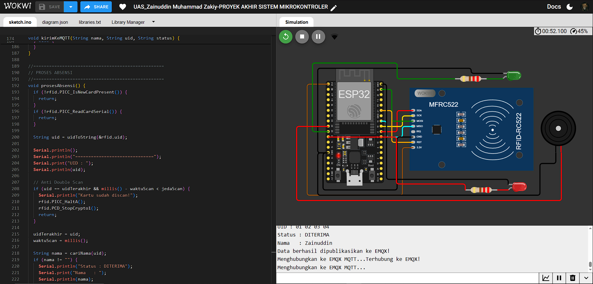
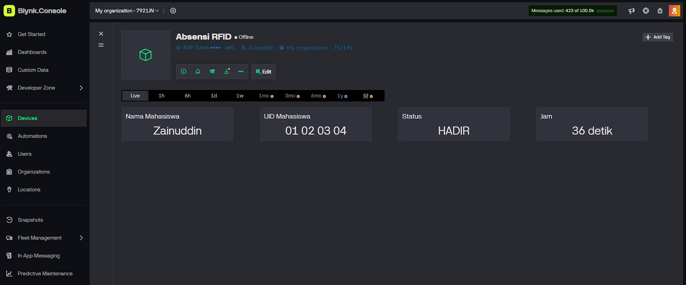
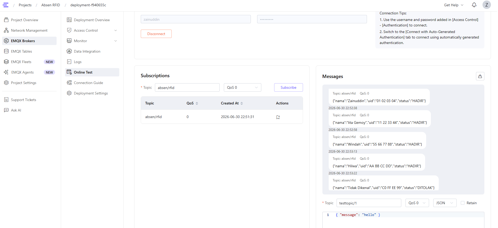

# 📚 Proyek Akhir Sistem Mikrokontroler

## 🚀 Sistem Absensi Mahasiswa Berbasis RFID Menggunakan ESP32, Blynk, dan MQTT (EMQX Cloud)


---

## 👨‍🎓 Identitas Mahasiswa

| Keterangan         | Informasi                     |
| ------------------ | ----------------------------- |
| **Nama**           | Zainuddin Muhammad Zakiy      |
| **NIM**            | 23552011173                   |
| **Kelas**          | TIF K 23B                     |
| **Mata Kuliah**    | Sistem Mikrokontroler         |
| **Dosen Pengampu** | Muchamad Rusdan, S.T., M.T.   |
| **Program Studi**  | Teknik Informatika            |
| **Universitas**    | Universitas Teknologi Bandung |

---

# 📖 Deskripsi Proyek

Proyek ini merupakan implementasi sistem absensi mahasiswa berbasis Internet of Things (IoT) menggunakan mikrokontroler ESP32 dan sensor RFID RC522.

Saat kartu RFID ditempelkan pada reader, ESP32 akan membaca UID kartu, kemudian mencocokkannya dengan database mahasiswa yang tersimpan di dalam program. Apabila UID terdaftar, sistem akan menampilkan status **HADIR**, menyalakan LED hijau, membunyikan buzzer, mengirim data ke dashboard **Blynk**, serta mempublikasikan data menggunakan protokol **MQTT** melalui **EMQX Cloud**.

Apabila UID tidak terdaftar, sistem akan menampilkan status **DITOLAK**, menyalakan LED merah, serta mengirimkan informasi tersebut ke dashboard dan broker MQTT.

---

# ✨ Fitur

* ✅ RFID RC522
* ✅ ESP32 DevKit V4
* ✅ Dashboard Blynk IoT
* ✅ MQTT EMQX Cloud
* ✅ LED Hijau
* ✅ LED Merah
* ✅ Buzzer
* ✅ Anti Double Scan
* ✅ Monitoring Real-Time
* ✅ Wokwi Simulator

---

# 🛠️ Komponen

| Komponen      | Jumlah |
| ------------- | ------ |
| ESP32 DevKit  | 1      |
| RFID RC522    | 1      |
| LED Hijau     | 1      |
| LED Merah     | 1      |
| Resistor 220Ω | 2      |
| Buzzer        | 1      |

---

# 📡 Teknologi yang Digunakan

* ESP32
* RFID RC522
* Arduino IDE
* Wokwi Simulator
* Blynk IoT
* MQTT
* EMQX Cloud

---

# 🔄 Alur Sistem

```text
RFID Card
     │
     ▼
RFID RC522
     │
     ▼
ESP32
     │
 ┌───┴─────────────┐
 │                 │
 ▼                 ▼
Blynk         MQTT EMQX
 │                 │
 ▼                 ▼
Dashboard     Broker MQTT
```

---

# 📷 Dokumentasi

## 1️⃣ Rangkaian Wokwi



---

## 2️⃣ Dashboard Blynk



---

## 3️⃣ Hasil Pengujian Serial Monitor



---

# 📁 Struktur Project

```text
.
├── assets
│   ├── rangkaian-wokwi.png
│   ├── dashboard-blynk.png
│   └── serial-monitor.png
├── diagram.json
├── libraries.txt
├── sketch.ino
└── README.md
```

---

# 📋 Cara Menjalankan Project

1. Clone repository ini.
2. Buka Wokwi Simulator.
3. Import file `diagram.json`.
4. Salin file `sketch.ino`.
5. Tambahkan library:

   * MFRC522
   * Easy MFRC522
   * Blynk
   * PubSubClient
6. Jalankan simulasi.
7. Scan kartu RFID.
8. Data akan tampil di dashboard Blynk dan dipublikasikan ke MQTT EMQX Cloud.

---

# 📺 Demo Video

Tambahkan link YouTube setelah video diunggah.

```text
https://youtube.com/xxxxxxxx
```

---

# 🔗 Link Project

**GitHub**

Tambahkan link repository GitHub.

```text
https://github.com/bang-jekk/UAS-SISMIK-ZAINUDDIN-MUHAMMAD-ZAKIY
```

**Wokwi**

Tambahkan link project Wokwi.

```text
https://wokwi.com/projects/468260370232776705
```

---

# 📄 Lisensi

Project ini dibuat sebagai tugas **Ujian Akhir Semester (UAS)** Mata Kuliah **Sistem Mikrokontroler** Program Studi Teknik Informatika Universitas Teknologi Bandung.

---

⭐ Terima kasih telah mengunjungi repository ini.
